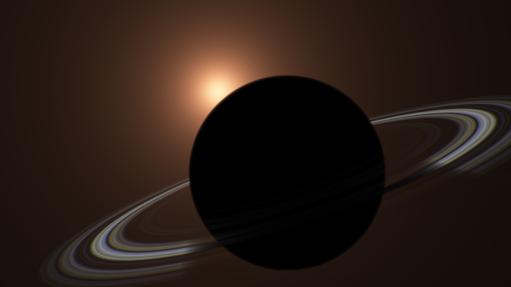

# Cassini's Cosmic Conclusion

A windows 1k intro by mrange & pestis.

## Prerequisites for building

You need Visual Studio (e.g. 2022), installed with [CMake](https://cmake.org/).

Following tools should be in path:

1. [crinkler](https://github.com/runestubbe/Crinkler) Note: As crinkler.exe, not
   link.exe
2. Optionally: [shader_minifier](https://github.com/laurentlb/Shader_Minifier)
3. Optionally: [glslangValidator](https://github.com/KhronosGroup/glslang)

## Build

1. Open the repository folder using Visual Studio
2. Choose the configuration:

| Config name      | Main | Shader-minifier? | Crinkler? | Can debug? | Comments                                         |
|------------------|------|------------------|-----------|------------|--------------------------------------------------|
| cmain-toolmin    | C    | Yes              | No        | Yes        | Used for fast iteration during development       |
| cmain            | C    | No               | No        | Yes        | Used to check the hand-minified shader works     |
| debug            | asm  | No               | No        | Yes        | Used to debug the asm written main               |
| release-toolmin  | asm  | Yes              | Yes       | No         | Used to check roughly the size of the shader     |
| release          | asm  | No               | Yes       | No         | Final release, should produce <= 1k executable   |
| release-comp     | asm  | No               | No        | No         | Same as release, but without compression         |

3. Hit F5 to build & run

CMake should copy the executables to the dist/ folder.

## How does it work

### Work in progress versions

First version of the music: https://www.shadertoy.com/view/lfK3Rt

mrange's "Sunrise on Saturn" shader: https://www.shadertoy.com/view/DldXDX

### Music - pestis

#### Basic loop

For the music, I originally wanted to explore the bVI-bVII-i climb-up. This
chord progression/resolution is something that I gravitate to whenever I am
playing in a minor key. In an early draft, I experimented with an arpeggiated
version of this chord progression. However, when I tried playing these different
arpeggiated chords on top of each other (aka the  [p01 / Brian Eno
trick](https://www.youtube.com/watch?v=9eGESjbpz1A)), the result was cacophony.
So, the basic loop had to be simplified.

I went with extreme minimalism: a loop of three notes, ascending in whole steps.

```
   r = t/32;                  // t is time in seconds, r is row in the song
   s = mod(r,1);              // position within row
   e = exp2(5-13*s-1/s);      // envelope, 1/s is the attack, -13*s controls decay, 5 is gain
   n = floor(r);              // integer row in the song
   f = exp2(mod(n,3)*2/12+8); // angular frequency
   out = sin(t*f)*e;          // oscillator * envelope
```

If you work out what different values of `n` give for `f`, you have 256, ~287,
~323. Divide by 2*pi to get 40.7 Hz, 45.7 Hz, and 51.3 Hz, i.e., E-F#-G# minus
19 cents. Apologies for bad tuning.

When repeating this loop infinitely, what key are we in? I thought this would be
a silly question to ask with so little information, but to my surprise, as I was
experimenting with this loop, I came to hear it much more as being in the key of
G# minor instead of being in the key of E major. I believe it has everything to
do with the whole step interval resolving much more strongly than a major third,
so the infinite ascending loop is:

... E (resolves to ->) F# (resolves to ->) G# (does not resolve ->) E ...

If you would make the loop descending instead, to me this sounds much more like
being in the key of E major:

... G# (resolves to ->) F# (resolves to ->) E (does not resolve ->) G# ...

Anyway, so far it's all pretty ambiguous. But it won't be for long.

#### Layering

Time to start layering. This time I add two loops for layering:

```
for(i1=1;i<4;i++) {
  for(j1=1;j<5;j++) {
   r = t*j/32+i/3;                // j makes the loop play faster, i delays the loop
   s = mod(r,1);
   e = exp2(20-13*s-1/s);
   n = floor(r);
   f = i*j*exp2(mod(n,3)*2/12+8); // we _multiply_ the frequency by i and j
   out += sin(t*f)*e;             // sum over all layers
  }
}
```

So both `i` and `j` affect the row of the loop, but `j` makes the loop faster,
whereas `i` "delays" the loop. Meanwhile, the frequency is multiplied by `i *
j`.

What notes are we hitting? As `i` goes from 1 to 3 and `j` goes from 1 to 4, the
cases `i = 2` and `j = 2` or `j = 4` are not doing anything interesting to the
frequencies, as they are just moving the frequency up by octaves. The
interesting cases are when we have a factor of 3 (`i = 3` and `j != 3` or vice
versa) and a factor of 9 (`i = 3` and `j = 3`). Multiplying by 3 corresponds to
moving the loop up by a perfect fifth (and an octave), so now we have loops of
B-C#-D# and F#-G#-A# there too. If you put all the notes together, we have a
scale of B-C#-D#-E-F#-G#-A#. Now it is pretty clear that we are in the key of G#
minor, emphasized by the bass climbing up from E to G#.

#### Effects and movement

So now we have a melody, but the sound is very boring. I wanted reverb and
followed the inspiration here: [phase
modulation](https://www.shadertoy.com/view/MdjXWc) with Brownian noise creates a
reverb-like sound. I tried adding some phase modulation to the oscillator:
`sin(t*f+p)*...`, where `p` was Brownian noise, generated in a brute force
manner by adding a lot of sine waves with semi-random phases and amplitude
decaying with higher frequencies. I then replaced this with `sin(sin(t*f)+p)`
because it produces somewhat similar results and fit better with the code
structure I had planned. Unfortunately, to make the intro fit 1024 bytes, all
these Brownian noise experiments had to be dropped from the final version. So
all that was left was a bit of phase modulation:
`sin(sin(t*f)+sin(t*3)+sin(t*11))`.

To add movement and song structure, a very slow modulation was added:
`sin(sin(t/j/48)*(sin(t*f)+sin(t*3)+sin(t*11)))`. This has the effect that all
instruments start from silence (as `sin(t/j/48)` is 0 whenever `t = 0`). The
lowest bass instruments with `j = 1` fade out when `t ~ 151` because `151/1/48 =
pi`. So the song now also has an ending around `t ~ 151`. For the faster
playing/higher instruments, we make them stop earlier by maxing out the row at
9: `r = min(t*j/32+i/3,9)`. Importantly, the last row (`r = 8`) has the note G#,
so we end on the root note, again emphasizing that we are in the key of G#
minor.

#### 16-bit rendering

The above code produces float samples between -1 and 1, and we are rendering the
music as grayscale pixels on the screen, and reading those to RAM in blocks of
512 x 512 pixels. But we didn't have the bytes to set up floating point or
16-bit targets, and thus the values got rounded into 8-bit resolution. We could
convert the float samples to 8-bit samples with `*127+127`, but the quantization
noise was definitely audible.

Instead, we opted for signed 16-bit samples, in the range -32768 .. 32767.
First, we calculate the song time with `t = (ivec3(gl_FragCoord).x +
ivec3(gl_FragCoord).y * 512 + u.z + 1) / 2 / 48e3 + 350,` where `u.z` is a
uniform controlling which block is being rendered. Notice the first part is an
integer, so `/2` does an integer division and thus time advances only every two
pixels.

Add a bit of gain to the envelope `exp2(5-...)` -> `exp2(20-...)`, so the
samples are now between -32767 and 32767. Then output the sample with
`sample >> ivec3(gl_FragCoord).x % 2 * 8) % 256 / 255.` Every even sample has
`>>0`, so this outputs the lower byte of the 16-bit sample, and every odd sample
 has `>>8`, so this outputs the higher byte of the 16-bit sample. Then just
scale this to the 0..1 range.

#### Closing words

After sizecoding, all of the above looks like this:

```
for(s=0;4>++s;)
  for(d=0;5>++d;)
    m=(ivec3(gl_FragCoord).x+ivec3(gl_FragCoord).y*512+v.z+1)/2/48e3+350,
    c=mod(y=min(m*d/32+s/3,9),1),
    i=(ivec3(
         z+=sin(sin(m/d/48)*(
            sin(m*d*s*exp2(mod(y-c,3)/6+8))*4+sin(m*3)+sin(m*11)
         ))*exp2(20-13*c-1/c)
      )>>ivec3(gl_FragCoord).x%2*8)%256/255.;
```

While the slow pace and the phase modulation (fake reverb?) definitely add to
the space feeliness of this song, it is interesting to note that Hans Zimmer
used exactly the same bVI-bVII-i chord progression in *Interstellar*. See
Charles Cornell's [analysis](https://www.youtube.com/watch?v=6AI6PG7oj7E) of it.
The chord progression stays pretty much the same throughout the Interstellar
soundtrack, and all the progression comes from adding layers and layers of
instruments on top. I had seen the above analysis before composing this song,
but wasn't actively trying to emulate *Interstellar*, except perhaps
subconsciously. Yet when I played the first prototype of the song to mrange, the
reaction was:

"gets nice space ambient feels from this"

It is pretty interesting that such simple equations could convey similar
feelings to the listener.


